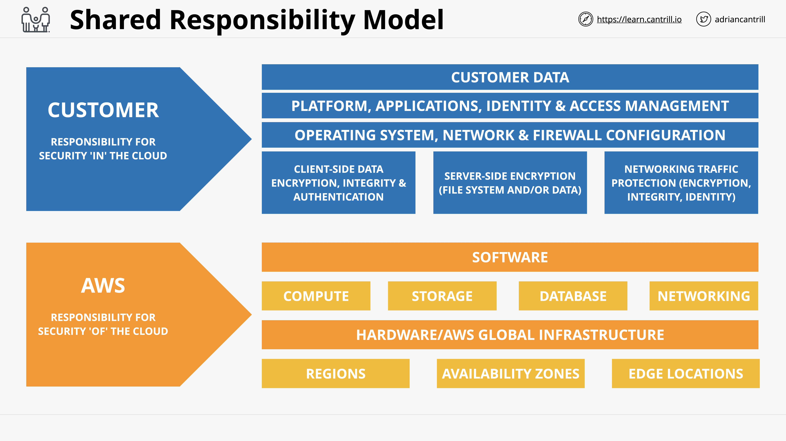
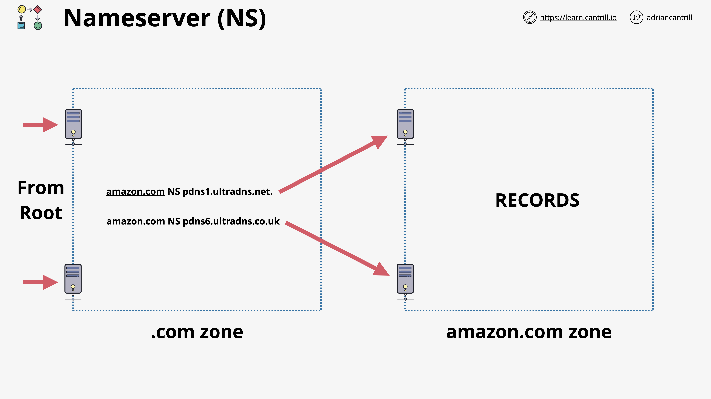
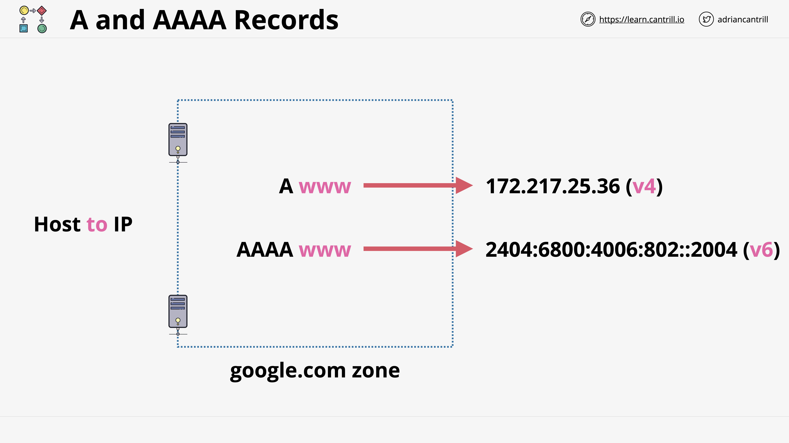
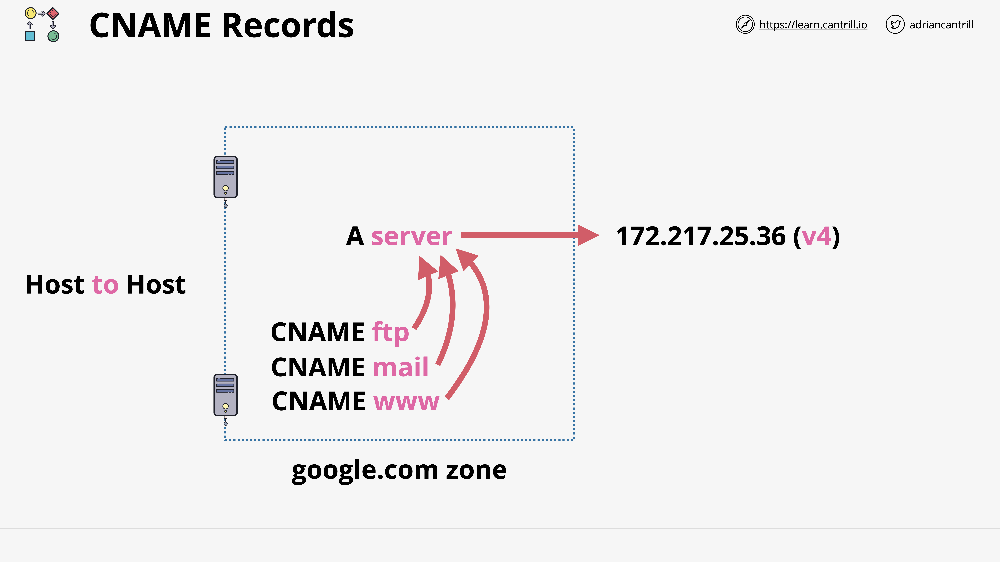
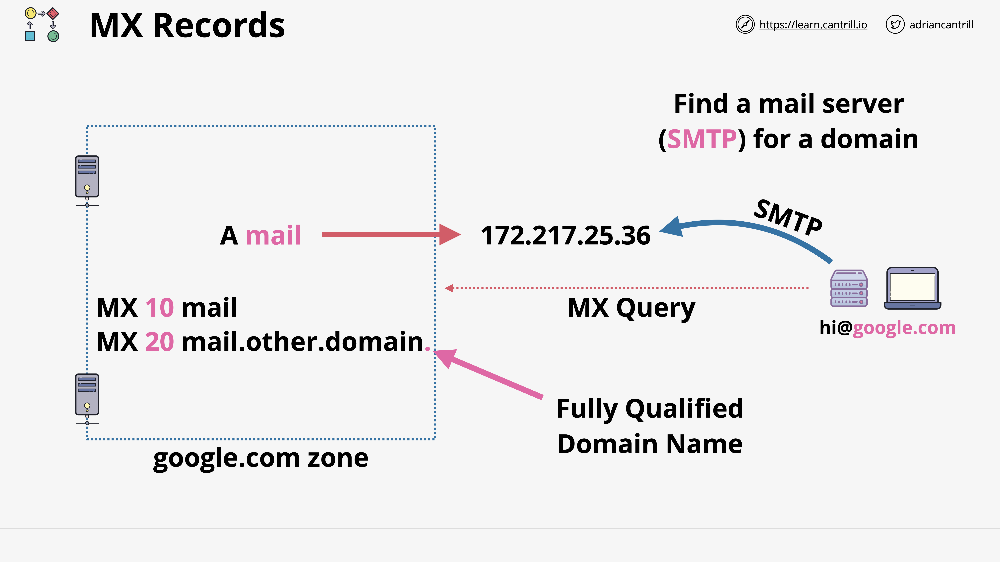
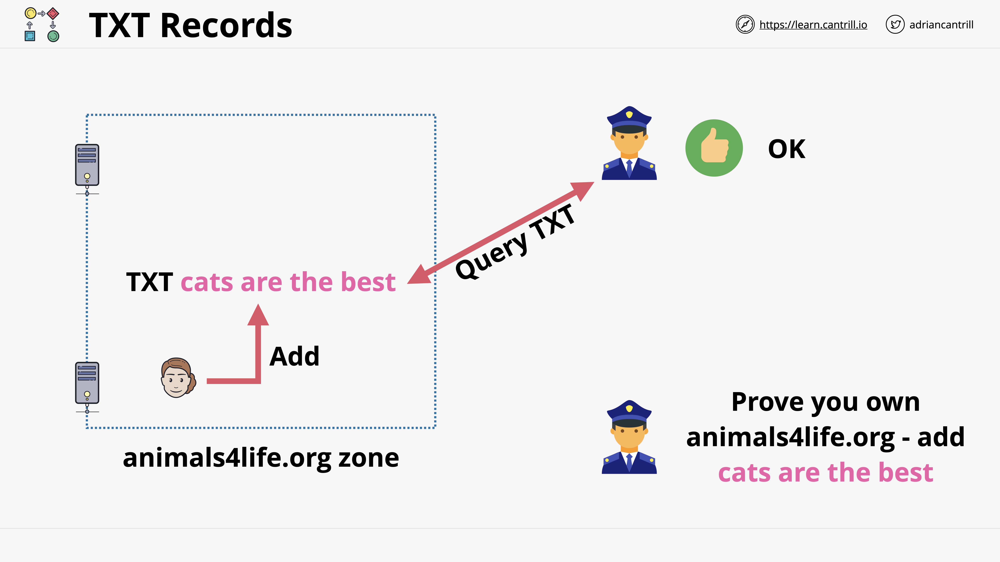
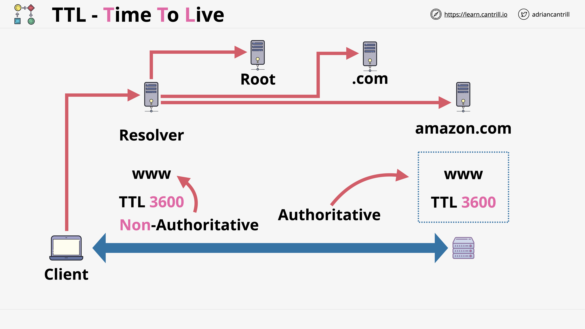

# AWS Fundamentals 

## PUBLIC INTERNET Zone (ie. gmail, e-commerce) 

- "PUBLIC" Zone (public internet)
- "AWS PUBLIC" Zone (ie. s3. Network connected to Public Internet.)
- AWS PRIVATE Zone (ie. EC2. Behind an API gateway. Needs to pass through AWS Public)
- Region - all services are available
- Edge Location - selected services, used to mitigate high latency. There are more edge locations than regions.
- Globally Resilient (ex. IAM, Route53. One centralized data for all)
Region Resilient (ex. EC2. Each region has different copies)
AZ Resilient (prone to hardware failure. Other AZ inside the same region will not have a copy)

 

## VPC Introduction

- VPC = networks inside AWS. It is within 1 acct and 1 region.
- VPC is Regionally resilient.
- VPC CIDR (172.31.0.0/16) - range of IPS the VPC can use. 
- VPC can be subdivided into Subnets. Set during creation and can never be changed. Subnets are within CIDR

### 2 types of VPC

 - Default
    - max 1 per region (can be removed or recreated)
    - initially created by AWS
    - a lot of preconfiguration already done by AWS, means its inflexible
    - always configured with 1 CIDR only and it's always 172.31.0.0/16
    - 1 /20 Subnet -> 1 AZ. 
    - Number of subnets for a default VPC is equal to the number of AZs in the region the VPC was located in.
    - by default already has Internet gateway(IGW), Security Group(SG), NACL, Subnets, assigned public IPv4 addresses
- Custom
    - can have multiple per region
    - 100% private by default
    - everything needs to be configured
    - used more in real life
    - can have multiple CIDR

 

## EC2 Introduction

- EC2 is IAAS. Provides Virtual Machines
- EC2 is in private AWS zone.
- EC2 is configured to launch in single VPC subnet, so it is AZ resilient.
- can connect to public zone, but the VPC will need to support public access
- Has On-demand billing per second.
-  local storage, on-host storage, EBS (Elastic Block Store) = network storage available to instance
- port 3389 RDP (windows instances)
- port 22 SSH (linux instances)
- Needs key pair to connect (private and public key)
    - private - used by user to match with public key
    - public - AWS keep in EC2 instance

Access EC2 local ssh: 

    cd <A4L path location>
    ssh -i "A4L.pem" ec2-user@ec2-35-172-200-244.compute-1.amazonaws.com

### An instance can have **states**:

- Running
    - Bills charges for hardware components
- Stopped
    - You're not billed charges (except storage)
- Terminated 
    - One way change, non reversible.
    - You're not billed charges even for storage

 

### Amazon Machine Image (AMI) = image of an EC2 instance

- AMI -> EC2 -> AMI

- AMI Contains Permissions
    - Public access = everyone allowed
    - Owner only = implicitly allowed because they own it
    - Specific AWS account (explicit) = specific accounts allowed, granted by owner
- AMI Contais Volumes
    - Boot Volume = kinda like boot drives like C:/ in Windows
    - It has at least 1 volume (boot volume) but there can be more (data volumes)
- AMI has Block Device Mapping
    - Connects volumes and how they are presented to OS (which is root? data?)
    - mapping volume -> device ID which OS understands

 

## S3 Introduction

- Global Storage Platform
- Regional Resilient
- Public Service (in AWS public zone)
- Allows unlimited data and multi-user
- Objects - files
    - key = file name
    - value = content
- Buckets - containers of objects
    - key can be used to map to bucket
    - created in specific region (primary home region).
    - can be placed in other region, but unless configured, the default is it will stay in 1 region
    - blast radius = region
    - bucket name needs to be GLOBALLY unique
        - 3 - 63 characters, all lower case, no underscore
        - starts with lower case or number
        - can't be IP formatted (1.1.1.1)
    - can store unlimited number and size of data
    - has a flat structure. No folders within folders.
    - Bucket number: 100 soft limit for an AWS account, 1000 hard limit (via support request)
    - a bucket can have UNLIMITED number of objects

### S3 is an object store, not file or block.
 - it has no folder (not a file)
 - can't be mounted (not a block)
 - can be accessed by multiple users (not like a block that only limits one user at a time)

 ### Amazon Resource name (ARN) 
 - used as identifiers

        example: =============
        arn:aws:s3:::koalacampaign20231234567

 

## CloudFormation Introduction

- can be a YAML or json
- When you give the template to cloudformation, CFN will create a stack.
- Stack has all the logical resources that the template tells it to contain.
- per 1 logical resource in your stack -> 1 physical resource is created

 

### Different Parts of CloudFormation Templates

- Resources : the only mandatory part of the CloudFormation template.
- Description : free text field.
    - needs to immediately follow AWSTemplateFormatVersion if used.
- Metadata : controls grouping, order, labels etc. (how it's presented in AWS console)
- Parameters : where you can add fields which prompt the user for more information.
- Mappings : it allows you to create lookup tables
- Conditions : Allows decision making in the template
- Output : shows output once the template is finished. 

 

## CloudWatch Introduction

- collects and manages operational data

- 3 main jobs
    - Metrics (CPU, disk usage, visitors/sec etc.)
        - Gathers data natively
        - non-native data (outside AWS) needs CloudWatch agent
        - monitoring things inside products which arent exposed to AWS needs CloudWatch agent as well (ie. which processes are running inside EC2 instance)
    - CloudWatch Logs
    - CloudWatch Events
        - Generates an event in response to something 

### Namespace 
- container for monitoring data
- has rule set for names
- all AWS data goes to AWS namespace: AWS/[service] 

### Metric 
- time ordered set of datapoints

### Datapoint
- consist of timestamp and value

### Dimension
- instance ID + instance type
- used to filter datapoints for a particular instance only

### Alarms
- Connected to a metric.
- based on configuration, it will take an action based on that metric
- Has the following states:
    - OK - do nothing
    - ALARM - do something (SNS or action)
    - INSUFFICIENT_DATA - the alarm is ongoing gathering data before it determines OK or ALARM state

Inside EC2, you can do stress test using this command:

        sudo yum install stress -y

        // -c 1 = t2.micro has 1 virtual cpu
        // -t 3600 = run the stress for 3600 seconds
        stress -c 1 -t 3600 
        
## Shared Responsibility Model

- AWS is responsible for the security "of" the cloud.
- Customer is responsible for security "in" the cloud.

 

## High-Availability vs Fault-Tolerance vs Disaster Recovery

- Abbreviated as HA, FT and DR.

### High Availability (HA)
- Minimise any outages
- ensure agreed level of operation performance.
- maximizes a systems online time.
- Doesn't care about user experience. There might be some hassle for the user but it's tolerable as long as there's availability.

### Fault Tolerance (FT)
- Operate through faults
- much more complex and expensive vs HA
- enables system to continue operating properly in the event of the failure of some components
- Not having FT means potentially putting life at risk. That's the key difference with HA. For example, you would rather have a plane with Fault Tolerance rather than High Availability.

### Disaster Recovery (DR)
- Used when HA and FT did not work
- a set of policies/tools/procedures to enable recovery following a natural or human-induced disasters.

  

## Route53 Introduction
- service that allows you to register domains
- it can host zone files in managed nameservers
- A global service with single database
    - Globally Resilient - can tolerate failure of one or more regions

### Top Level Registries
- IANA: 
    - .com, .io, .net
    - Manages the DNS Root Zone
- PIR: .org
- Registry: Maintains the zones for a TLD (ie. .org)
- Registrar : Type of organization that has relationships with the .org TLD zone manager allowing domain registration.

### Organizations that manage the DNS Root Server
- etc... there are 12 in total

### Domain Registration Process using Route53
1. Check if domain is available.
    - There are 13 DNS root servers.
2. Route53 creates zone file for the domain being registered
    - zone file/hosted zone = database with all DNS info about the domain
3. Allocates name servers for the zone 
    - name servers = servers that Route53 creates and manages which are distributed globally
    - normally there's 4 name servers per 1 individual zone
4. Put zone file onto the 4 managed name servers
5. Liase with name registries (for the top level domain) to add the name  server records into the zone file (top level domain zone).
    - name server records = This is how the registry delegate the admin of the domain tools
6. By adding the name server records to the org zone, they indicate that the 4 name servers are all authoritative for the domain.

### Hosted Zones
- Route53 provides DNS zones and hosting for those zones.
- Route53 is a DNS as a service
    - it lets you create and manage zone files (called "hosted zones" in Route53 terminology because they're hosted on AWS managed name servers)
- When a hosted zone is created, a number of servers are allocated and linked to that hosted zone. So that means 1 hosted zone = 1 name server.
- Can be public
    - Data is accessible on the public internet.
    - The name servers for a public hosted zone live in AWS public zone. It means it's accessible anywhere with the public internet connection.
    - Part of public DNS system.
- Can be private
    - It means it's linked to one or more VPCs and only accessible from within those VPCs.
    - Used to host sensitive DNS records.
- A hosted zone hosts DNS records.
    - records are called "record sets" in Route53.

 

## DNS Record Types

### Nameserver records (NS records)
- Record types which allow delegation to occur in DNS. 
- name server records are how delegation works end-to-end in DNS.

### A and AAAA Records
- Converts a HOST to IP
    - A www -> 172.217.25.36 (v4)
    - AAAA www -> 2404:6800:4006:802::2004 (v6)

### CNAME Records
- Stands for "Canonical Name"
- Lets you create a DNS shortcut (Host to host records)
- all CNAMES will resolve to the same IPv4 address
- used toremove admin overhead
- CNAMES cannot point directly at an IP address, only other names.

### MX Records
- used for emails
- It is how the server can find the mail server for a specific domain.

### TXT Records
- Also known as "text record".
- Allows you to add abitrary text to a domain
- A way for DNS to provide additional functionality.
- Common usage: 
    - fight spam
        - indicate which entities are authorized to send email for example.
    - proving domain ownership.
        - Query TXT to make sure that it matches the value that the external party is expecting.

### DNS TTL (Time To Leave) concept
- can be set in DNS records.
- numeric value in seconds.
- Authoritative server = source of truth. reached by traversing from root (it will take time)
    - Gives authoritative answer = answer from source of truth.
- Non-authoritative server = Can be the resolver server (by our internet provider)
    - Cached value from Authoritative server
    - faster to retrieved vs authoritative answer because there's no need to do traversal
    - The non-authoritative answer (cache) information will stay in the Resolver server within the time set as TTL. If TTL 3600 is set, the record will stay for 1 hour (TTL 3600 = 1 hour).
- TTL values need to be balanced.
    - Too low value will mean more queries against your nameservers.
    - Too high value means less queries, but less control. (Example: There migh be delays in email sending if there's a record change but MX TTL is set too high)
- Resolvers should obey TTL values. But it can be configured to ignore them by the admin of the resolver server.
- It's adviced to lower the TTL value well in advance of the work (days or weeks) to make sure that you have less caching issues.

