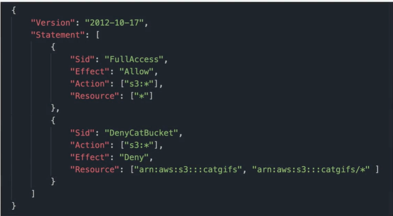
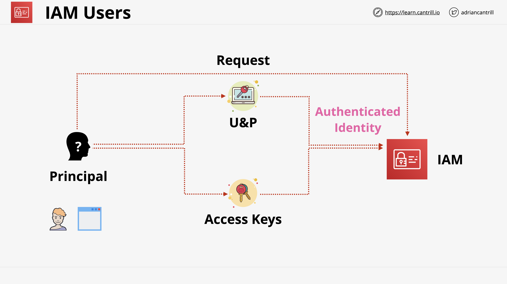
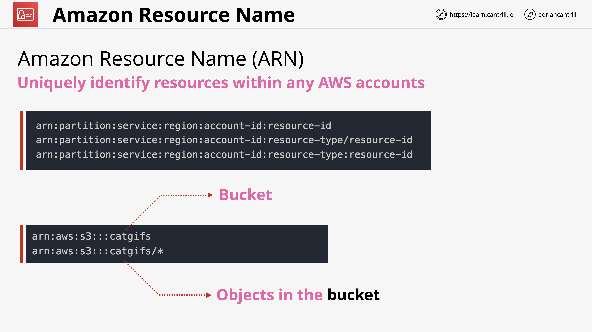
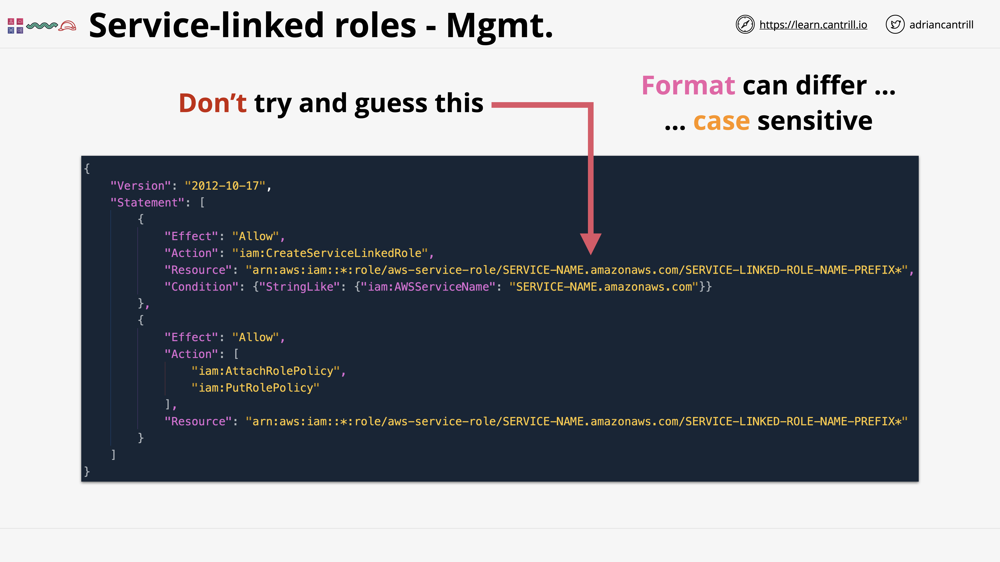
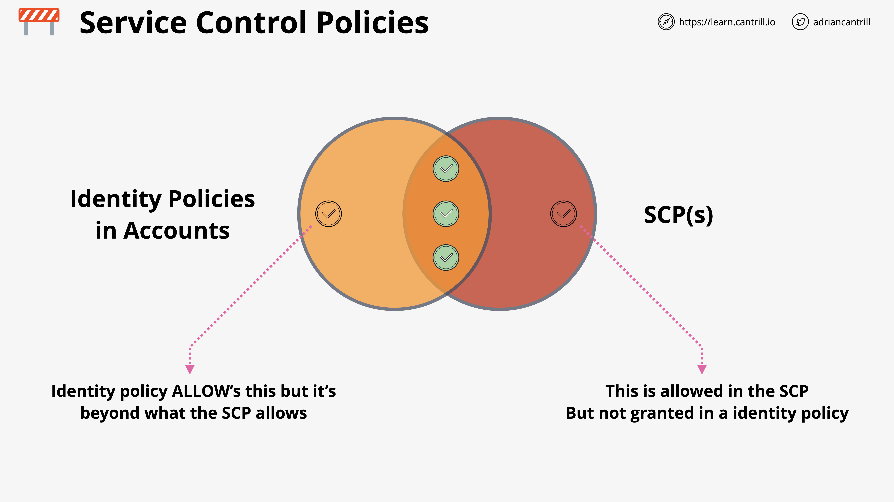
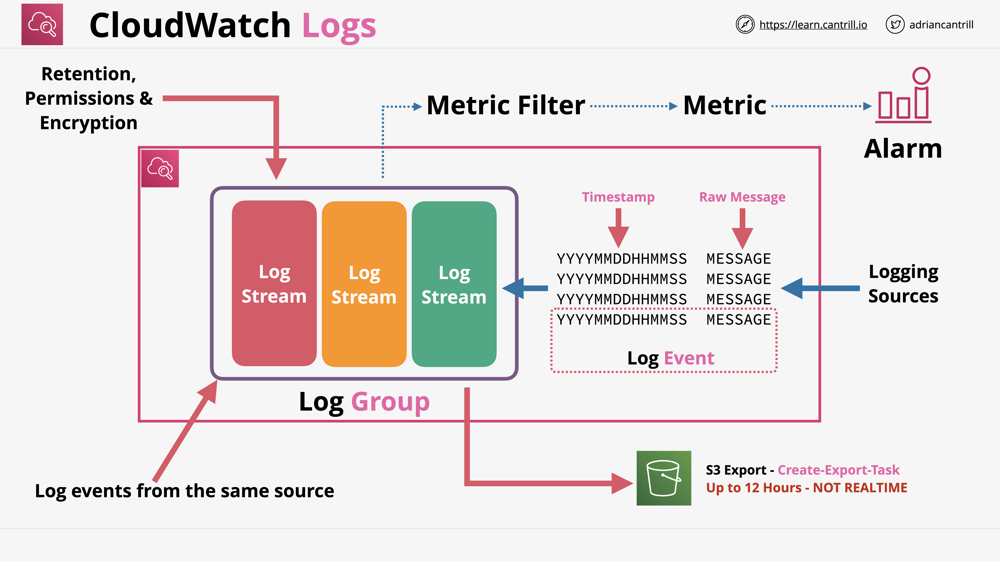

# IAM, Accounts and AWS Organisations

## Identity Policies

### Identities
- IAM users
- IAM groups
- IAM Roles

### IAM Policies/ IAM Identity Policies
- Type of policy which gets attached to identities inside AWS.
- A set of security statements to AWS.
    - it grants or denies access to AWS products and features to any identity that uses that policy.
- Can also be attached to resources (ex. S3 bucket) by referencing IAM users and IAM roles using ARNs.

### Identity policies/ policy documents
- created using json:

- What makes up a statement:
    - Sid (Statement ID)
        - optional field
        - lets you identify a statement and what it does.
        - best practice is to use it.
    - Action
        - format #1: \<service> : \<operation>
        - format #2: \<service> : *
        - format #3: list of multiple independent actions.
    - Resources
        - matches AWS resources.
        - format #1: [*]
        - format #2: [arn, arn]
        - ARN = Amazon Resource Name
    - Effect
        - either allow or deny.
        - controls what AWS does if the action and the resource part of the statement match the operation that you're attempting to do with AWS.

### Policy Rules
- First priority: Explicit DENY
    - If you have a statement which explicitly denies access, nothing can overrule that.
- 2nd priority: Explicit ALLOW
    - If there's both explicit DENY and ALLOW policies, explicit DENY will take priority.
- 3rd priority: Default DENY (implicit)
    - If there are no explicit policies, then implicit DENY will take effect. 
- All identities start off with no access to any AWS resources except for Account root user. <i>If they're not given access, then they are not allowed access.</i>
- deny, allow, deny.

### Policy Types
- Inline policies
    - assign json to 3 separate accounts/users.
    - when to use?
        - For special or exceptional allows or denies.
        - Generally, this is for exceptions to the normal access rights that you want to grant.
- Managed policies
    - created as their own object.
    - attach one object to multiple accounts/users.
    - advantages:
        - Reusable
        - Low management overhead
    - 2 types of managed policies:
        - <u>AWS managed policies</u> = created and managed by AWS.
        - <u>Customer managed policies</u> = you can create and manage so you can define them as per the exact requirement of your business.

 

## IAM Users and ARNs

### IAM Users
- An identity used for anything requiring long-term AWS access (ex. humans, application, service accounts)
- Starts with Principal = unknown identity
    - needs to be authenticated by IAM
        - via user/pass if it's a human
        - via access key if it's a application or someone trying to use the CLI.
    - Once authenticated, the principal is now known as an authenticated idenity.
    - once known as authenticated indentity and the principal tries to do an action (ex. upload to an S3 bucket), AWS checks that that identity is authorized to do so by checking policies.

### Amazon Resource Name (ARN)
- Uniquely identify resources within any AWS accounts.

### ARN fields
- Partition
    - the partition that the resources is in.
    - for standard AWS regions, partition = AWS.
    - If you have resources in other partitions, partition = AWS-\<partition name>
        - sample: china beijing region = AWS-cn
- Service 
    - Service namespace that identifies the AWS product (ex. S3, IAM, RDS)
- Region
    - The region that the resources your referring to resides in.
- Account ID
    - Account ID of the AWS account that owns the resource.
- Resource/ Resource Type
    - Varies depending on the service.
    - resource id can be the ID or the name of an object.

### IAM Users limitations
- Only allowed max 5000 IAM users per account.
    - IAM is a global service so this is a per account limit, not region.
    - This is a hard limit and cannot be increased.
- An IAM user can be a member of max 10 IAM groups.
- If you have a project/scenario that needs more than 5000 identifiable users/identity, then it's likely that IAM users are not the right identity to pick for that solution. However, this can still be fixed by using IAM Roles and Identity Federation (to be discussed).

  

## IAM Groups
- Containers for IAM users.
- exists to manage large sets of IAM users easier.
- you can't login to IAM groups (have no credentials of their own).
- Used solely for organizing IAM users.
- an IAM user can be a member of multiple IAM groups.

### Benefits of groups
- allow effective administration-style management of users.
    - ex. groups can represent team, projects, functional groups in the business
- Groups can have both inline and managed policies attached to it.
- IAM group does not have limit for memberships. 
    - adding 5000 IAM users (max allowed count of users per account) to a single IAM group is possible.

### Limitations of groups
- Limit = 300 groups per account, but this can be increased with a support ticket.
- There is no concept of all-users group.
- You can create a group and then add all IAM users in it, but you have to create and manage it yourself and it doesn't exist natively unlike other identity management solutions. 
- IAM groups cannot have nestings (groups within groups)
- IAM groups can have users and permissions attached.
- IAM groups do not have login credentials
- Groups are NOT a true identity. They can't be referenced as a principal in a policy.
- A resource policy cannot grant access to an IAM group. You cannot reference them in a resource policy.

 

## IAM Role

- One type of identity that exists inside an AWS account (the other type is IAM users).
- IAM users are used when there is a single principal, but the IAM role is best suited to be used by an unknown number or multiple principals.
- candidates for IAM role:
    - If you don't know how many principals would there be.
    - If user count is more than 5000 (which is the max count limit for IAM users)
- Generally used on a temporary basis. 
    - Akin to borrowing user permission for a short period of time. You become an identity inside the account for a short period of time.
- Roles are real identities just like IAM users.
- Roles can be referenced within resource policies.

### IAM Role policies
IAM user can have permission policies (inline and managed), but for roles it can have 2 types of policies:
1. Trust Policy
    - Controls which identities can assume that role.
    - It can reference identities in the same account (ex. IAM users, IAM roles, AWS services like EC2) and identities in other accounts. 
    - It can allow anonymous usage of the role and other types of identities (ex. Facebook, Twitter, Google).
    - If a role is assumed by something which is allowed to assume it, AWS generates <u>temporary security credentials</u>.
        - pretty much like access keys. However instead of being long term, they are time-limited.
        - Generated by an AWS service called Secure Token Service (STS).
            - operation used to assume the role and get credentials.
            - sts:AssumeRole
        - once expired, the identity needs to renew them by reassuming the role.
        - Once renewed, a new credential is generated and given to the identity which assumed that role.
        - Access will be granted by checking against the permissions Policy.
2. Permissions Policy
    - Same as with the earlier lessons.
    - If changed, the permissions of the temporary security credential also changes.

### When to use IAM Roles

1. When using AWS Lambda.
    - function as a service.
    - Not an AWS identity, so it needs some way of getting permissions to do things when it runs.
    - We can use access key, but there's a better way to do so instead of hardcoding access keys: To provide permissions, we can create an IAM role (known as <u>"Lambda Execution Role"</u>)
        - This role has a trust policy that trusts the lambda device, allowing lambda to assume that role whenever a function is executed.
        - This role has a permissions policy which grants access to AWS products and services.
        - Triggers sts:AssumeRole, then gives temporary credentials to the runtime environment that the Lambda function runs in to be able to access AWS resources.
    - perfect for IAM roles usage because:
        - You don't know how many copies a lamda has.
        - It's not ideal to hard code access keys due to security risk and additional overhead when rotating keys.
2. Emergency/ out of usual situations.
    - When break glass is needed by assuming an Emergency Role.
3. When adding AWS into an existing corporate environment.
    - Wanting to offer SSO to employees with existing identities from an external provider (ex. Active Directory), or if there might be >5000 identities already.
    - External identites cannot be used directly to access AWS resources. They need to assume an IAM role for temporary access (Identity Federation).
4. Designing architecture for popular mobile applications
    - With millions of users.
    - Same as #3, interacting with AWS resources needs AWS identity (for example if the mobile app interacts with DynamoDB), but there's a 5000 max IAM users limit. So it will use Web Identity Federation. It will use web identities (ie. google, facebook, twitter) and these identites can assume the role based on the trust policy.
    - No AWS Credential will be stored on the app if roles are used
    - Uses already existing accounts.
    - scales to 100,000,000's of users.
5. Cross-account access
    - If you want to access the AWS service of a different account (ex. uploading objects to their S3 bucket for processing), the receiver will not want to duplicate your identities to give each user an access. They will use a role instead to give you temporary access to upload to S3.
    - Can also be used to give temporary access to the whole account.

## Service-linked roles and PassRole

### Service-linked Role
- A special type of IAM role.
- IAM role that is linked to a specific AWS service.
- Provides permissions that are pre-defined by a service.
- Provides permissions that a service needs to interact with other AWS services on your behalf.
- Service-linked roles might 
    - be created by the service itself, 
    - or the service might allow you to create the role during the setup process of that service,
    - or it might also get created within IAM.
- Difference with IAM role: 
    - You can't delete a service-linked role until it's no longer required.

Sample of a policy that allows you to create a service-linked role:

### Role Separation
- Is where you might give one group of people the ability to create roles, and another group of people the ability to use them.

### PassRole
- This allows the user to pass an existing role into an AWS service, but not edit or create that role.
- Can exceed permission that the user already has.
- A method inside AWS which gives you the ability to implement role separation.
- Can also be used with service-linked roles.
- more info: https://blog.rowanudell.com/iam-passrole-explained/

## AWS Organizations

- Used to manage multiple AWS accounts.
- single AWS account = <u>standard AWS account</u>
    - account that is not within an organization.
- <u>Management Account</u> = the standard account that created the organization.
    - old name : Master Account
    - other name Payer Account
    - can invite other standard accounts to become part of an AWS organization.
    - once invite is accepted by standard accounts, they become <u>member accounts</u>.
    - aside from inviting existing accounts, you can also create an account directly within the organization (there will be no invitation process).
- can have 1 and only 1 management account.
- can have 0 or more member accounts.
- <u>Organization root</u>
    - a container within an AWS organization, which can contain AWS accounts (member or management accounts).
    - can contain other containers known as <u>organizational units</u> or OUs.
        - can contain AWS accounts as well.
        - can container other organizational units.
- Individual billings per member account will become <u>Consolidated billing</u>
    - member account will pass the billing through management account.
    - Payer account is the account that contains the payment method for the organization (the management account).
- Can do consolidation of reservations and volume discounts.
- Features a service called <u>Service Control Policies (SCPs)</u>
    - Lets you restrict what AWS accounts within the organization can do.
- Role switch = Accessing from on-premise, or a management account to an AWS account via IAM role. Then from there it will provide access to different other accounts in the same organization. In the back-end, it lets you assume a role in those other accounts so you can access them.

## Service Control Policies (SCPs)
- Lets you restrict AWS accounts within the organization.
- They can limit what the account (the account root user itself and its identities) can do.
    - You can't restrict the account root users directly, but you can restrict the allowed usages of the account itself.
    - ex: Limit possible regions, Limit possible EC2 instance sizes.
- a policy file (JSON) that can be attached to organization root or to OUs. Can also be attached to individual AWS accounts.
- Inherited in the organization tree.
- the management account is NEVER affected by SCPs.
- Don't grant permissions. They are just boundaries. permissions are still handled by identities.

### You can use SCPs in two ways:
1. Deny list
    - Allow by default, then block certain cervices.
    - This is the default. When you enable SCPs in organization, AWS apply a default policy (FullAWSAccess) having no restriction.
    - priority rule is the same: deny, allow, deny.
    - has much lower admin overhead.
2. Allow list
    - Block by default, then allow certain services.
    - 1st step is to remove FullAWSAccess policy, meaning everything will have implicit deniesat the start. Then add services you want to allow into a new policy.
    - has more overhead.

### Combining Identity policy and SCP

- Only the three green policies will take effect. 
- The policy needs to be allowed in both identity policies and SCP.

## CloudWatch Logs
- A public pervice. hosted in AWS public zone.
- Regional service.
- Store, monitor, access logging data.
- has built in integration with many AWS services.
- How to log data to cloudWatch log:
    - AWS services which can log into CloudWatch directly.
    - Via unified cloudWatch agent.
    - use development kits in AWS and implement logging to cloudwatch logs directly.
- Can generate metric based on logs (metric filter).
- Log events: events coming from logging sources
- Log stream: group of events from the same source or instance.
- Log groups: container of Log streams for the same type of logging.
    - stores configuration settings and metric filters.
    - these settings/filters will apply to log streams inside the log group.

 

## CloudTrail
- A product which logs API actions which affect AWS accounts.
- Logs API calls/activities (called <u>CloudTrail event</u>)
    - a record of activity in AWS account.
    - can be taken by the users/role/services.
- CloudTrail is NOT Realtime.
    - delivers logs within 15 minutes of the account activity occuring.

### Types of CloudTrail events
- management events
    - Management operations performed on resources (also known as control plane operations).
        - ex. creating/terminating EC2 instances, creating VPC, logging in an IAM.
    - By default, CloudTrail only logs management events because data events are often much higher in volume.
- data events
    - resource operation performed on or in a resource.
        - ex. objects accessed and uploaded to S3, Lambda is invoked.
- insights events
    - [to be discussed]
    - Identify unusal activity, errors or user behaviors.

### CloudTrail Trail
- Unit of configuration within the cloudTrail product.
- It 's how you tell cloudTrail on how to operate.
- A trail logs events for the AWS region that it's created in.
- Regional Service.
- When a trail is created, it can be configured to operate in 2 ways.
    - Create a trail which is a <u>one-region trail</u>.
        - Only ever in the region that it was created in.
    - Create a trail which is for <u>all regions</u>.
        - Collection of trails in every AWS region but it's managed as one logical trail.
        - When AWS adds a new region, an all-region trail is automatically updated.
- Global Services always log to <u>us-east-1</u> region (ex. IAM, STS, CloudFront).
    - classified as <u>Global Service Events</u> - would need to be enabled on a trail. Otherwise, trail will just log events in the region it was created in.
- Regional Services log to their own specific regions.

### Defaults
- By default, it stores the last 90 days of CloudTrail events in an Event History (for free).
    - If you want to customize (add days to the default 90), you need to create 1 or more <u>Trails</u>.
        - You can set the trail to store the logs in json format to an S3 bucket indefinitely.
        - You can set the trail to store the logs inside CloudWatch logs.
- By default, CloudTrail <u>only logs management events</u> because data events are often much higher in volume.
- By default, <u>Global Service events are disabled</u>.

### Organizational Trail
- If you create the trail from the management account of an organization, it can store all info from all the account inside that organization.

 

## AWS Control Tower
- Quick and easy setup of multi-account environment.
- Orchestrates other AWS services to provide different functionalities
    - under this is AWS Organizations.
    - It also uses IAM Identity Center (formerly known as AWS SSO), CloudFormation, Config etc.
- think of it as an evolution of AWS Organizations adding significantly more features, intelligence and automation.
- A product that brings features of lots of different AWS products together and orchestrates them.

### Parts of Control Tower
- Landing Zone
    - well architected multi-account environment
        - has a concept of home region.
            - You can  explicitly allow or deny the usage of other AWS regions, but the home region (the one that you deploy into) is always available.
    - built with different functionalities mentioned above.
    - Has a concept of foundational OU, by default called the <u>Security OU</u>.
        - Under it are Log Archive and Audit AWS accounts used for security and auditing purposes.
    - <u>Sandbox OU</u>
        - For testing and less rigid security situations.
    - You can create more OUs with different structures.
    - Uses IAM Identity Center (AWS SSO)
        - provide SSO across multiple-accounts within the Landing Zone.
        - capable of <u>ID Federation</u>
            - You can use your existing identity stores to access all of these different AWS accounts.
    - Landing Zone provides monitoring and notifications using CloudWatch and SNS.
    - You can allow end users to provision new AWS accounts within the Landing Zone using <u>Service Catalog</u>.
- Guard Rails
    - Detect or mandate rules and standards across all AWS accounts within the landing zone.
    - Rules for multi-account governance
    - <u>Types of guard rails</u>:
        - Mandatory : Always applied 
        - Strongly recommended : Strongly recommended by AWS
        - Elective : can be used to implement fairly niche requirements (optional)
    - <u>Function of guard rails</u>:
        - preventative : Stop you doing things (AWS Org, SCP)
        - detective : compliance check. Uses AWS config to check that the configuration of a given thing within an AWS account matches what you define as best practice. 
            - clear, in violation or not enabled.
    
- Account Factory
    - Automates and standardises new account creation.
    - Feature that allows automated account provisioning.
        - done by either admin or end users with appropriate permissions.
    - Automated provisioning includes the application of guard rails.
    - end users can be given admin access to provision accounts for any purpose which you define as ok.
    - Applies standard account and network configuration.
    - Allows account to be closed or repurposed.
    - Can be fully integrated with a business SDLC using APIs (not just via UI).
- Dashboard
    - single-page oversight of the entire organization.

