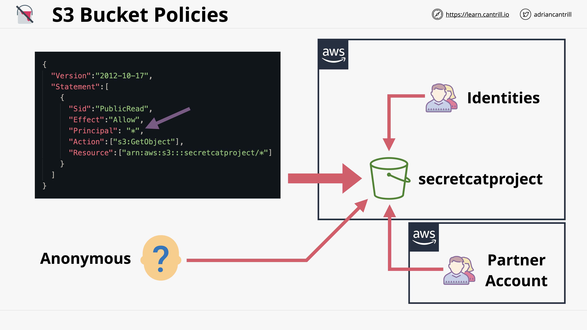

# Simple Storage Service (S3)

## S3 Security (Resouce Policies & ACLs)

### S3
- Private by default.
- initial access is granted to Account root user (account which created it) by default.
- Granting access priviledge for other accounts will need to be done explicitly.
    - By using S3 bucket policies.

### Bucket Policies
- A type of <u>AWS Resource Policy</u>.
    - Just like an identity policy, but as the name suggests, they're attached to resources instead of identities.
    - Answer the question: who can access that resource?
- Identity polices or Resource Policy, which to use?
    - Limitation of identity policy is that you can't grant access/give identity policy to users outside your account. So for these kinds of scenarios, you can use resource policies instead.
    - Resource policy allows access for identities from the same account or different accounts.
    - Resource policy can allow or deny anonymous principals (principals not identified by AWS), unlike identity policy  that needs to be attached to an authenticated identity.
- Common uses of bucket policies (based on resource policy description):
    - Grant access to other AWS accounts.
    - Allow anonymouse access to a bucket.

### Parts of Bucket policies
- One major different with identity policy is the explicit <u>"Principal"</u> component.
    - defines which principals are affected by the resource policies.

### Access Control List (ACLs) [LEGACY]
- subresource of buckets
- ACLs on objects and bucket
- Inflexible and allows simple permissions only
    - ex. Can't have conditions like bucket policies. Only has 5 possible permissions

### Block Public Access
- Additional settings/bounderies that only applies to anonymous principals.
- It will always apply no matter what the bucket policy contains.
- This is to avoid issues with unknowingly giving public access which results to data leak. This were caused by genuine lack of knowledge about the security model or config mistakes.

 

## S3 Static Website Hosting
- normal access of S3 objects is via AWS APIs.
- Static website hosting feature allows access via HTTP (ex. blogs)
- Static Website hosting common examples
    - creating static blogs.
        - Index and error documents needs to be set (HTML)
        - You can only use a custom domain (via Route53) with a bucket if the name of the bucket matches the domain.
    - Offloading
        - offload static media from a compute service/EC2 for example to an S3.
        - Compute services tend to be relatively expensive so it's ideal to offload what we can to S3.
        - needs to be placed in a bucket with static hosting enabled.
    - Out-of-band pages
        - a method of accessing something that is outside of the main way.
        - Error or status notification system. For example if a page is hosted in an EC2 and you want to show a page during its maintenance period, then it doesn't make sense to also put that page in the same EC2.
- S3 <- data : free
- S3 -> data : charged per GB

## Object Versioning and MFA Delete

### Object versioning
- controlled at a bucket level.
- Starts with disabled state. You can optionally set to enable but you can NOT make it disabled again.
- Once enabled, you can set it to suspended. Unlike disabled state, you CAN switch a suspended bucket back to enabled again.
- Once supended, it stops new versions from being created but it does nothing with the existing versions.
- key = file name. this is unique.
- id = always null if versioning is disabled. If enabled, AWS will set an id value.
- when an object is modified: 
    - disabled versioning: it will be replaced by a new object. 
    - enabled versioning: AWS will create a new object with different id value (version number) higher than orig value to denote latest version.
    - You can specify the version to interact with using a particular id. If none supplied, then it's implied that you want to interact with the current latest version.
- When an object is deleted:
    - Objects are not really deleted, instead, a Delete Marker will be created.
        - Delete marker is basically a copy of the current object but hides all previous versions of that object.
        - You can remove Delete Markers. The object will then be "undeleted" and will contain back all of its previous versions. The latest version of the "undeleted" object will also be set back as its latest version.
    - There's a way on how to "fully" delete an object (as in the object itself will now be gone) and this is via Version Delete.
        - To do that, delete an object and specify the particular version id.
        - If what you're deleting is the object's most recent version, then the next most recent will be set as the current version.
- Unlike "objects", When working with object "versions", everything is permanent.

### MFA Delete
- Something that is enabled within the versioning configuration on a bucket.
- If enabled:
    - it means that MFA is required to change bucket versioning state (enable, disable, suspend).
    - MFA is required to fully delete any versions.
- When changing bucket's versioning state or deleting a particular version of an object via API call, you need to pass  this concatenated string along with any API calls to interact: `[Serial number of MFA token] + [Code generated by MFA token]`
